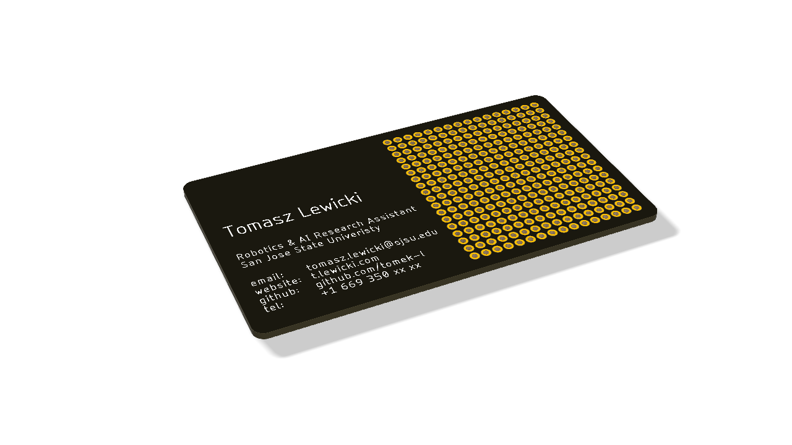

# PCB business card with a prototyping board on it. 

I got old enough that people now expect me to give them a business card.
It feels boring to have a normal, serious paper card so I decided to design one in Eagle and put all the information in white silkscreen on black soldermask. I added a little prototyping area on the right half.

## Placing a circuit on the board:
Ideally, the board would have a simple circuit or microprocessor on it in the future.
I am still looking for something that will be simple enough that it won't make me go bankrupt after ordering 100pcs. A working circuit would be also more understandable for people who are not electronics geeks.

## Some ideas for future versions:
- 5V to 3.3V converter (nice, because it's doable in all SMD parts)
- op-amp dev board (nice, because it's cheap and useful)
- FTDI UART to USB (useful but expensive)
- USB hub 
- TSSOP adapter
- SMD proto board
- micro SD card reader

